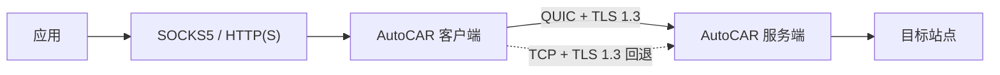

# AutoCAR

AutoCAR 是一个用 Go 编写的双端 TCP 加速代理：本地端提供 SOCKS5、HTTP 和 HTTPS Proxy，远端负责解析域名并连接目标；两端之间优先复用一条经过认证的 QUIC 连接，UDP 不可用时自动切换到 TCP + TLS 1.3。

> 项目目标是改善高时延、有丢包或大量短连接场景中的体验，而不是承诺“任何网络都更快”。稳定、低时延的直连链路可能更快。请先用内置基准在自己的真实路径上测量。

## 特性

- 双端架构：每个代理 TCP 流映射到独立 QUIC 双向流，避免一个应用流的有序传输阻塞其他应用流。
- 长连接复用：QUIC 会话及其拥塞状态可被后续短连接复用，减少重复传输握手带来的开销。
- 自动回退：新建流的 QUIC 路径失败后使用独立的 TLS 1.3/TCP 连接，并通过冷却机制避免每条新连接都等待 UDP 超时。
- 三种本地入口：SOCKS5 CONNECT、HTTP absolute-form HTTP/CONNECT、HTTPS Proxy（代理监听器本身使用 TLS）。
- 严格安全默认值：TLS 1.3、正常 X.509 主机名校验、无 `skip verify` 开关、禁用 QUIC 0-RTT、可选 mTLS、恒定时间令牌验证。
- 出口保护：默认阻止环回、私网、链路本地、多播、未指定地址，以及常见 SMTP 提交端口；域名在远端解析并逐个校验，只拨已批准的数字 IP，同时交错竞速 IPv6/IPv4，兼顾 DNS rebinding/SSRF 防护与双栈可用性。
- 有界资源：协议字段长度、连接数、流数和超时均有限制；中继使用背压而不是无限缓存。
- 可复现实验：内置上传/下载基准，并提供 Linux `netem` 场景用于直连与隧道的同条件比较。

当前版本只代理 TCP。SOCKS5 `BIND`、`UDP ASSOCIATE` 和 QUIC DATAGRAM 尚未实现，收到这些命令会返回标准“不支持”响应。

## 数据路径



AutoCAR 是 split proxy，而不是把原始 TCP 包再次塞进 UDP。它在本地终止代理连接、通过 QUIC 流传送字节、再从远端建立新的 TCP 连接，因此不会形成 TCP-over-TCP 或双层可靠重传。

## 快速开始

需要 Go 1.25 或更高版本。

```bash
git clone https://github.com/cppla/autocar.git
cd autocar
go build -trimpath -o autocar ./cmd/autocar
```

在服务端生成共享令牌和包含真实域名/IP SAN 的证书：

```bash
./autocar token --out token
./autocar cert \
  --hosts relay.example.com,203.0.113.10 \
  --cert server.crt \
  --key server.key
```

将 `token` 和用于信任的 `server.crt` 通过安全的带外通道复制到客户端。私钥 `server.key` 只留在服务端。

启动远端。UDP 和 TCP 可以使用同一个端口号：

```bash
./autocar server \
  --listen :443 \
  --cert server.crt \
  --key server.key \
  --token-file token
```

启动本地端：

```bash
./autocar client \
  --server relay.example.com:443 \
  --ca server.crt \
  --token-file token
```

默认监听：

| 入口 | 地址 | 示例 |
|---|---:|---|
| SOCKS5 | `127.0.0.1:1080` | `curl --proxy socks5h://127.0.0.1:1080 https://example.com` |
| HTTP Proxy | `127.0.0.1:8080` | `curl --proxy http://127.0.0.1:8080 https://example.com` |
| HTTPS Proxy | 默认关闭 | 使用 `--https`、`--proxy-cert` 和 `--proxy-key` 开启 |

`socks5h` 会把域名交给远端解析。HTTP 访问 HTTPS 目标时使用 CONNECT；AutoCAR 不伪造目标证书，也不解密应用到目标站点之间的 HTTPS。

## 本地代理认证

本机独占使用时保留环回默认监听即可。多人机器或非环回监听必须设置本地代理认证：

```bash
export AUTOCAR_PROXY_USER=alice
export AUTOCAR_PROXY_PASSWORD='replace-with-a-long-random-secret'

./autocar client \
  --server relay.example.com:443 \
  --ca server.crt \
  --token-file token \
  --socks 127.0.0.1:1080 \
  --http 127.0.0.1:8080
```

SOCKS5 用户名密码和 HTTP Basic 在本地这一跳本身不加密，因此程序默认拒绝把这两个明文入口绑定到非环回地址。跨主机使用请开启带 TLS 的 HTTPS Proxy；只有在已经存在可信外层网络时，才应显式使用 `--allow-public-plaintext`。

## 证书与 mTLS

客户端必须二选一：

- `--ca <PEM>`：固定私有 CA/自签名证书，推荐自建部署使用；
- `--system-roots`：明确使用操作系统信任库，适合公共 CA 证书。

证书名称与连接地址不一致时，用 `--server-name` 指定证书 SAN。程序不会提供跳过验证的选项。若需要双向证书认证，服务端设置 `--client-ca`，客户端同时设置 `--client-cert` 与 `--client-key`。共享令牌仍作为每条隧道流的第二层授权。

## 出口策略

默认禁止通过中继访问内网地址，防止被滥用为开放代理或 SSRF 跳板。确实需要访问服务端所在私网时，可在充分信任所有客户端后设置 `--allow-private`；环回、链路本地、多播和未指定地址仍然禁止。默认拒绝端口 `25,465,587`，可用 `--deny-ports` 调整；`--deny-cidrs` 可额外封锁云厂商控制面或部署专用网段。

任何非环回代理监听都必须配置认证。生产环境还应使用主机防火墙，仅向预期客户端开放 UDP/TCP 端口，并优先启用 mTLS。

## 性能验证

基准服务默认仅监听 `127.0.0.1:9000`。只在同一主机测试时可直接启动：

```bash
./autocar bench-server
```

跨主机测量必须显式确认非环回监听：

```bash
./autocar bench-server \
  --listen 0.0.0.0:9000 \
  --allow-public-benchmark
```

> `bench-server` 没有认证，远程请求者可以让它持续发送或接收大量数据。
> 非环回监听只应在临时、受控的测试窗口使用；同时用主机/云防火墙把
> 端口 9000 严格限制到预期客户端和中继 IP，并在测量后立即停止服务。
> CLI 默认还把单次传输和并发传输分别限制为 64 MiB 和 16；公开测试时
> 只应按实际需要调低或谨慎调高 `--max-bytes` / `--max-connections`。

分别测直连和隧道，确保目标、字节数、次数和链路条件完全相同：

```bash
./autocar bench-client \
  --transport direct \
  --target target.example:9000 \
  --bytes 8388608 --iterations 7 --warmup 2 --json

./autocar bench-client \
  --transport quic \
  --server relay.example.com:443 \
  --ca server.crt --token-file token \
  --target target.example:9000 \
  --bytes 8388608 --iterations 7 --warmup 2 --json
```

最可能受益的是高 RTT、存在随机丢包、多个并发/连续短连接，以及直连路径质量明显差于中继路径的场景。TCP/TLS 回退主要提供可达性，并不声称比直连 TCP 更快。详细方法和 Linux `netem` 脚本见 [基准说明](docs/BENCHMARK.md)。

## 安全边界与封锁

TLS 1.3 为客户端到中继的载荷提供机密性、完整性和服务端身份验证；禁用 0-RTT 避免 CONNECT 请求被重放。应用自身使用 HTTPS 时，从应用到目标的内容仍保持端到端加密。

观察者仍能看到端点 IP、端口、包长、时序，以及使用 UDP/TLS 的事实；中继也知道目标地址。不存在能保证永不被网络运营者识别、限速或封锁的传输。AutoCAR 的策略是提供两个标准、安全的承载路径：优先 QUIC，在 UDP 被阻断时回退到 TLS/TCP，而不是声称“不可检测”。完整威胁模型见 [SECURITY.md](SECURITY.md)。

回退只适用于尚在建立或之后新建的代理流。已交付给应用的 QUIC 流若在传输中途失去 UDP 路径，无法安全地把任意 TCP 字节无缝重放到另一条 TLS 连接；该流会失败，由应用重试，随后新流在熔断冷却期内走 TLS。

## 开发与测试

```bash
go test ./...
go test -race ./...
go vet ./...
```

协议、部署和设计细节分别见：

- [Wire protocol](docs/PROTOCOL.md)
- [Deployment guide](docs/DEPLOYMENT.md)
- [Architecture](docs/ARCHITECTURE.md)
- [Benchmark methodology](docs/BENCHMARK.md)

## License

MIT，见 [LICENSE](LICENSE)。
