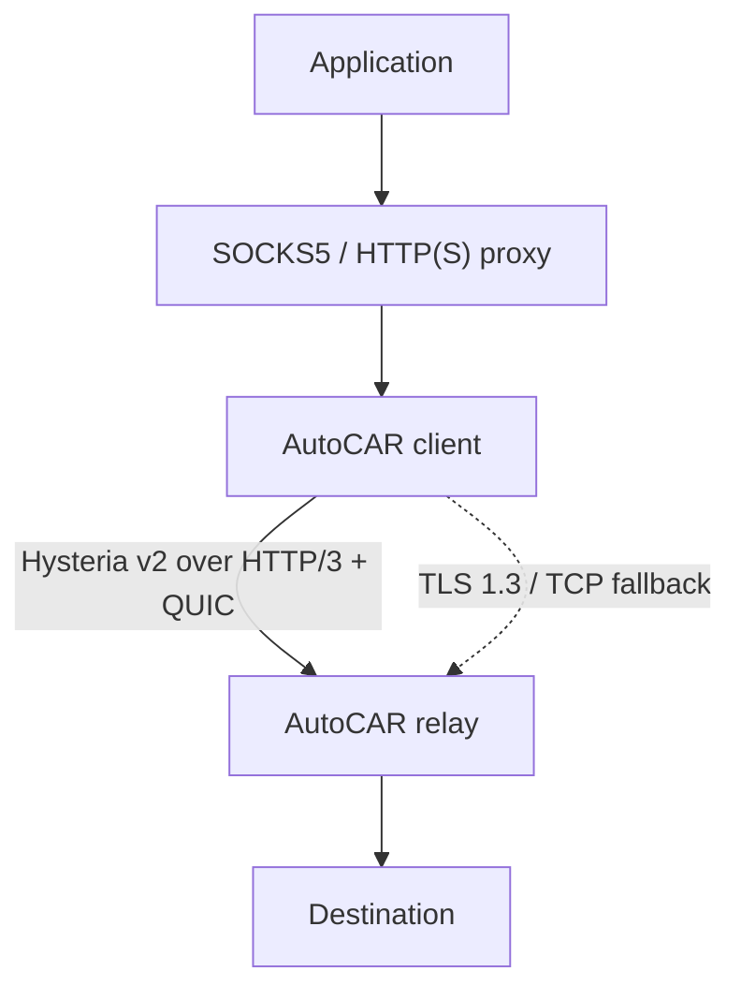

# Architecture

AutoCAR is a split proxy, not a kernel TCP optimizer. The client terminates a
local SOCKS5 or HTTP(S) proxy request, carries it through an authenticated
dual-ended tunnel, and the relay creates a new TCP or UDP flow to the
destination. Raw TCP segments are never nested inside another TCP stream.

## Components

| Component | Responsibility |
| --- | --- |
| Local proxy | SOCKS5 CONNECT and UDP ASSOCIATE, HTTP absolute-form requests, HTTP CONNECT, and an optional TLS-protected HTTPS proxy listener |
| Hysteria adapter | Reconnecting Hysteria v2.12.1 client/server, HTTP/3 authentication, TCP streams, QUIC DATAGRAM, Fast Open, BBR/Brutal selection, cover handling, and optional Salamander wrapping |
| Automatic dialer | Tries Hysteria v2 over UDP, opens a bounded circuit breaker after a path failure, and sends new TCP flows through the real TLS/TCP fallback |
| Legacy tunnel | Preserves AutoCAR wire protocol v1 over legacy QUIC and over the TLS/TCP fallback |
| Safe outbound | Resolves names at the relay, rejects unsafe results, dials approved numeric addresses, and rechecks every UDP destination |

The default UDP engine is `hy2`. On the client, `--transport=quic` is an alias
for `--transport=hy2`; it no longer selects AutoCAR's original QUIC protocol.
The old engine remains available as `--transport=legacy-quic` together with
server `--quic-engine=legacy`. See [PROTOCOL.md](PROTOCOL.md) for the exact
compatibility matrix.

## Dual-ended acceleration

One long-lived QUIC connection carries many independent flows. A proxied TCP
connection maps to one bidirectional QUIC stream; a SOCKS5 UDP association maps
to a Hysteria UDP session carried by QUIC DATAGRAM frames. This preserves a
warm RTT and congestion model across short flows while that session remains
connected, and avoids TCP's
connection-wide application head-of-line blocking between unrelated streams.
Reconnection creates a cold QUIC/TLS/controller/PMTU session; state is not
claimed to survive it.

Each endpoint controls the traffic it sends. QUIC ACKs provide delivery,
loss, and RTT feedback from the opposite endpoint, so both client-to-relay and
relay-to-client directions adapt independently:

- with bandwidth hints left at zero, each sender uses real BBRv1-derived model
  control by default (or Reno when explicitly selected);
- with a non-zero client bandwidth hint, the corresponding direction
  negotiates a capped Brutal pacing rate with the relay; and
- QUIC loss recovery remains the standards-based RFC 9002 packet-threshold,
  time-threshold, and probe-timeout machinery regardless of congestion mode.

This ACK feedback satisfies the public objective commonly called
"reverse-control" or dual-ended feedback. It is not the proprietary prediction
or retransmission algorithm from ServerSpeeder/LotServer/Zeta-TCP, and AutoCAR
does not claim protocol compatibility with those products. The controller
details and boundaries are documented in [ACCELERATION.md](ACCELERATION.md).

## TCP path

The Hysteria client maintains a reconnecting authenticated HTTP/3 session.
Opening a proxy flow creates a bidirectional stream and sends a bounded target
address request. Fast Open is disabled by default. When explicitly enabled,
the stream can accept the first application bytes before the relay's
destination-dial response is read; a refusal is surfaced on the first read.
Stream limits, open deadlines, QUIC flow control, and operating-system
backpressure bound resource use. `MaxIncomingStreams` applies per QUIC
connection; the hardened core also applies listener-wide and per-source-key
handler gates across QUIC connections before reading a TCP target, plus a
finite request-header deadline. Separate
listener-wide TCP and UDP exit gates bound active target sockets across all
sessions. Accepted-but-unauthenticated HTTP/3 connections have a finite
authentication lifetime, and incoming unidirectional control streams have a
separate small per-connection cap. After QUIC Retry proves return-path
reachability, both global and source connection gates apply before handshake
state. The source key is an IPv4 address or IPv6 `/64`; clients sharing a NAT
or prefix intentionally share that budget.

The TLS/TCP fallback has an independent listener-wide connection gate and a
per-source gate using the same IPv4-address / IPv6-`/64` keying. Both are held
from acceptance through handshake and for the complete relay lifetime.

In `auto` mode, failure to establish or use the UDP session causes a new TCP
flow to be opened through one TLS 1.3 connection dedicated to that flow. A
valid relay-side destination error or authentication rejection is not retried
through fallback. Existing streams are never replayed or migrated: if UDP
fails after a stream has been handed to an application, that application must
retry and the new flow can use TLS.

## UDP path

SOCKS5 UDP ASSOCIATE is exposed only when the selected transport implements
datagrams. The client validates the UDP source against the SOCKS control
connection and rejects SOCKS fragmentation. Hysteria assigns a logical session
and fragments oversized Hysteria datagrams to the negotiated QUIC DATAGRAM
size. Before any per-session map or fragment slice is allocated, the relay
enforces global and per-source UDP-session caps across QUIC connections (IPv4
address or IPv6 `/64`);
fragment count and reassembled payload size have fixed limits.
One logical Hysteria UDP payload is limited to 4,096 bytes. The SOCKS frontend
drops a larger payload before transport serialization without closing the UDP
association; ordinary Internet-MTU datagrams are unaffected.

At the relay, every requested UDP destination is resolved and checked against
the same port, CIDR, private-address, and special-use policy as TCP. The
destination is resolved and filtered again for every outbound write, so DNS
changes cannot bypass the SSRF boundary. UDP sessions expire after a bounded
idle period. TLS/TCP fallback deliberately does not emulate UDP because doing
so would add cross-datagram head-of-line blocking and misleading semantics.

## Congestion and loss recovery

Congestion control chooses how quickly new data is put on the wire; loss
recovery decides when QUIC retransmits lost frames. They are separate:

- BBR estimates delivered bandwidth and minimum RTT, derives a BDP, and paces
  through STARTUP, DRAIN, PROBE_BW, and PROBE_RTT.
- Brutal paces at an explicitly configured rate and can compensate for the
  measured ACK/loss rate. It is opt-in and is not congestion-fair.
- The QUIC transport declares loss using RFC 9002 packet and time thresholds
  and sends PTO probes when ACK feedback stalls. AutoCAR does not replace this
  with a proprietary predictor and does not add FEC.

The controller runs in userspace on the AutoCAR QUIC connection. It does not
change the host's Linux `tcp_congestion_control`, accelerate unrelated sockets,
or act as a transparent TCP interception layer.

## Security and probe behavior

Both data paths use TLS 1.3. Clients must opt into either an explicit trust
anchor (`--ca`) or the operating-system roots (`--system-roots`), and normal
chain plus DNS/IP SAN verification is mandatory. A shared token is still
required and is compared in constant time; optional mTLS adds a client
certificate factor.

Without Salamander, unauthenticated HTTP/3 requests receive a small neutral
cover page instead of an AutoCAR-specific error. The client also uses the
Hysteria transport's Chrome-oriented QUIC handshake fingerprint by default.
With Salamander, the UDP packet shape is obfuscated before it reaches QUIC;
ordinary HTTP/3 probes can no longer reach the cover site. Cover mode and
obfuscated-UDP mode are therefore alternative observable forms, not two layers
of one indistinguishable web service.

These measures reduce obvious active-probe signatures; they do not make the
relay invisible. An observer can still see endpoints, timing, volume, packet
sizes, and TCP/UDP use, and can block or rate-limit the relay IP or all UDP.
AutoCAR makes no guarantee of being unidentifiable or unblockable.

## Deliberate non-goals

- no kernel-wide or transparent TCP acceleration;
- no proprietary Zeta-TCP prediction, redundant retransmission, or FEC;
- no BBRv2 or BBRv3 claim (the implemented model is BBRv1-derived);
- no port hopping, Mimic, or user-facing ECH configuration;
- no interception of destination HTTPS and no replacement for application
  end-to-end encryption; and
- no promise that a relay improves every route or every workload.
