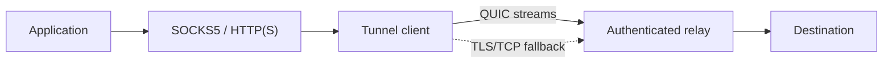

# Architecture

AutoCAR is a split proxy. It terminates a local proxy connection, carries its
byte stream over an authenticated tunnel, and creates a new TCP connection at
the relay. It never encapsulates raw TCP segments, avoiding nested TCP
retransmission and nested congestion-control loops.

## Design principles

1. **Standard cryptography.** TLS 1.3, normal X.509 validation, optional mTLS,
   and no custom cipher or certificate-verification bypass.
2. **One flow, one stream.** Each proxied TCP connection maps to an independent
   QUIC bidirectional stream so loss in one ordered stream does not impose
   application-level head-of-line blocking on every other stream.
3. **Bounded parsing.** Every variable-size protocol field has a small hard
   limit before allocation. Timeouts, stream limits, and backpressure bound
   resource use.
4. **Remote resolution with egress policy.** Hostnames are preserved across
   the tunnel. The relay resolves them, filters every resulting address, then
   dials only approved numeric IPs to prevent DNS-rebinding bypasses. Approved
   IPv6 and IPv4 candidates are interleaved and staggered so one blackholed
   address family does not consume the whole destination timeout.
5. **Correctness before aggression.** The default QUIC congestion controller
   is used until reproducible measurements justify a maintained transport
   fork. The TCP fallback favors reachability, not acceleration.
6. **Explicit limitations.** AutoCAR cannot remove propagation delay or
   guarantee higher throughput on every path. Stable, clean direct paths may
   be faster because a relay adds work and distance.

## Data plane

The QUIC client maintains a warm authenticated connection. Opening a proxy
flow creates a bidirectional QUIC stream and sends a bounded request containing
the command, destination, and authentication proof. The relay validates the
request and destination policy before dialing. A success response switches the
stream into opaque byte-forwarding mode. Half-close is propagated in both
directions.

When QUIC cannot be established, the optional fallback opens one TLS 1.3 TCP
connection per proxied flow and uses the same request/response framing. This
avoids building an unsafe custom multiplexer over a single TCP byte stream,
but it does not provide QUIC's stream independence.

## Control plane

Configuration is local and file/flag based. Tokens should be supplied through
an environment variable or a permission-restricted file rather than a command
line visible to other users. Certificates can be public-CA certificates or a
private certificate generated by the bundled command and distributed out of
band.

## Future work

- SOCKS5 UDP ASSOCIATE over QUIC DATAGRAM.
- Separate interactive and bulk QUIC sessions with bounded fair scheduling.
- Reproducible evaluation of CUBIC or BBRv3-based QUIC congestion control.
- Multi-relay path measurement and policy-based selection.
